# BTkAkademi ve StoreApp Projeleri

Bu repository, [ASP.NET Core MVC](https://github.com/cetinyazici/ASP.NET-Core-MVC) altında geliştirilen BTkAkademi ve StoreApp adında iki ayrı projeyi içermektedir. Her iki proje de C# dilinde yazılmış ve ASP.NET Core MVC framework kullanılarak oluşturulmuştur. Frontend'de Bootstrap kullanılarak responsif ve kullanıcı dostu arayüzler tasarlanmış, backend tarafında ise güçlü ve ölçeklenebilir .NET Core mimarisi kullanılmıştır.

## Projeler Hakkında

### BTkAkademi

BTkAkademi, öğrencilerin çeşitli kurslara başvuruda bulunabildikleri, kayıt işlemlerini gerçekleştirebildikleri ve kurs listelerini görüntüleyebildikleri, MVC (Model-View-Controller) mimarisi temellerini kullanarak geliştirilmiş küçük bir web uygulamasıdır.

#### Özellikler

- Kurs başvurusu için form doldurma ve kayıt işlemi
- Kurs listeleme özelliği
- MVC mimarisi kullanılarak yapılandırılmış temiz ve yönetilebilir kod yapısı

#### Teknolojiler

- C# ASP.NET Core MVC
- Bootstrap (Frontend tasarımı)
- JavaScript (Temel interaktivite için)
- SQL Server (Veritabanı yönetimi)

#### Ekran Görüntüleri

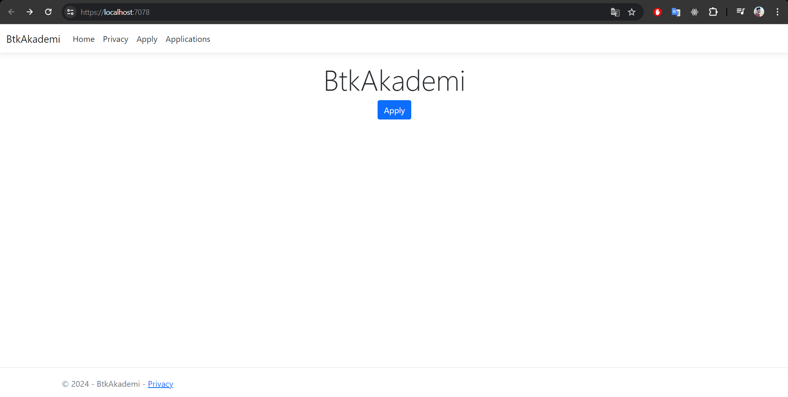
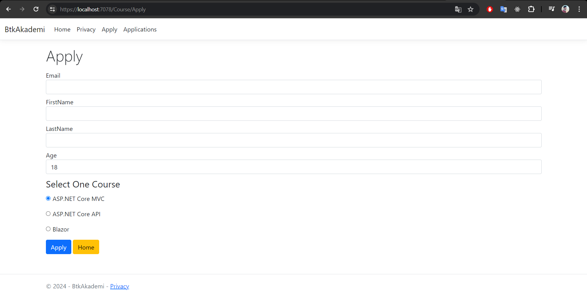
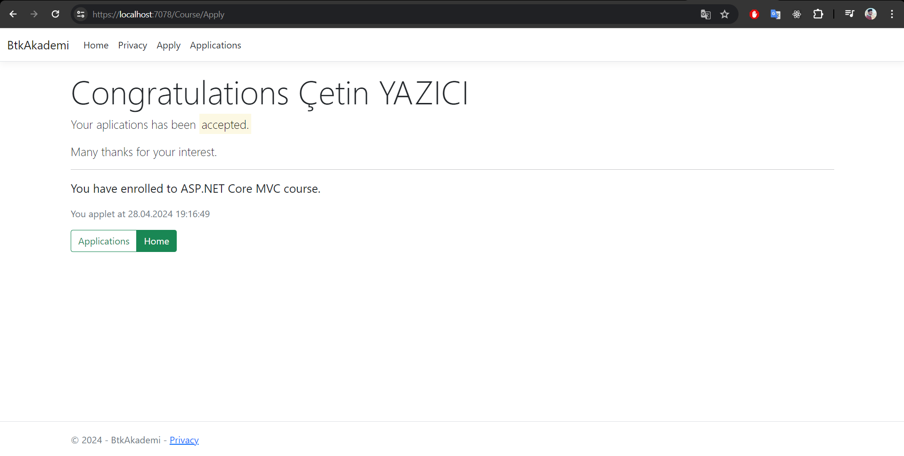
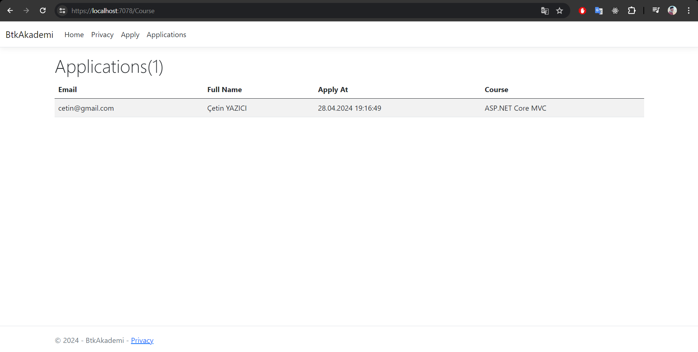

### StoreApp

StoreApp, kullanıcıların çeşitli ürünleri inceleyebileceği, arama yapabileceği, sepete ekleyebileceği ve satın alabileceği katmanlı bir e-ticaret platformudur. Kullanıcılar, ürün siparişi vermek istediklerinde login işlemlerini gerçekleştirirler. Ayrıca, ürün yönetimi ve sipariş takibi için yöneticilere özel bir admin paneli bulunmaktadır.

#### Özellikler

- Kullanıcı tarafından ürün arama ve listeleme
- Sepete ürün ekleme ve sepet yönetimi
- Kullanıcı girişi ve kayıt olma işlemleri
- Admin paneli üzerinden ürün yönetimi ve sipariş takibi

#### Teknolojiler

- C# ASP.NET Core MVC
- Bootstrap (Frontend tasarımı)
- JavaScript (Dinamik kullanıcı arayüzü interaksiyonları için)
- SQL Server (Veritabanı yönetimi)

#### Ekran Görüntüleri

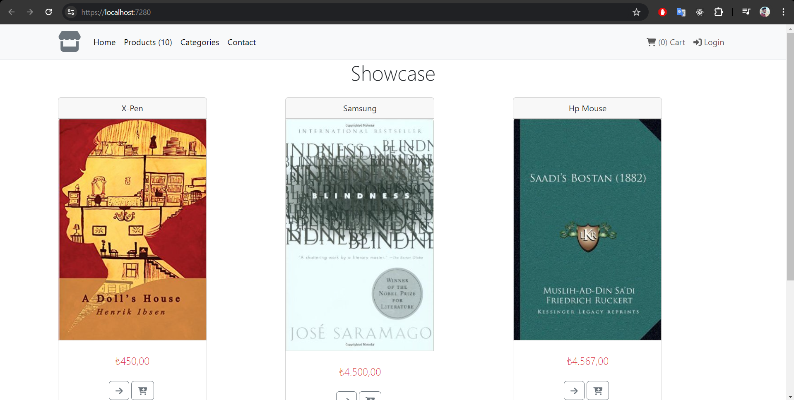
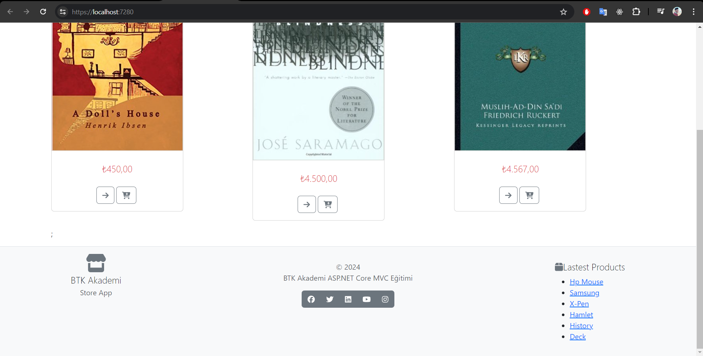
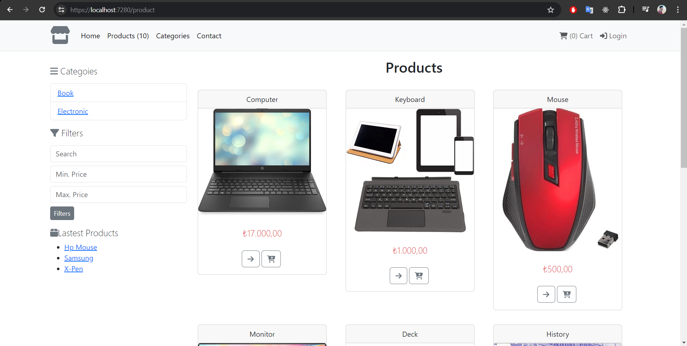
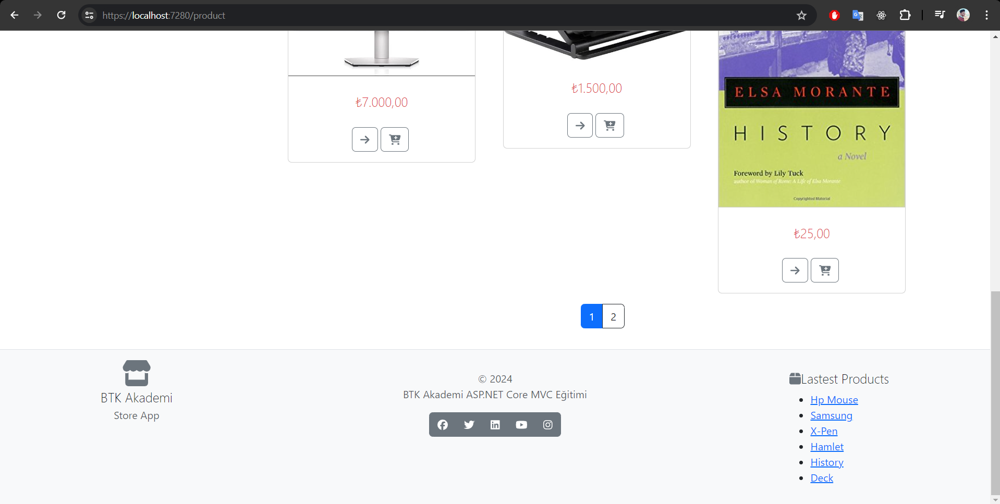
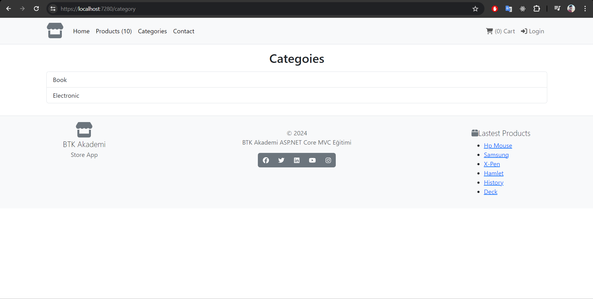
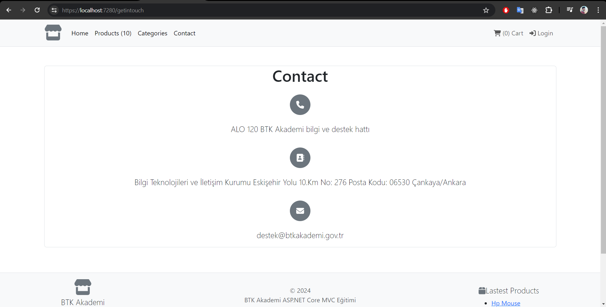
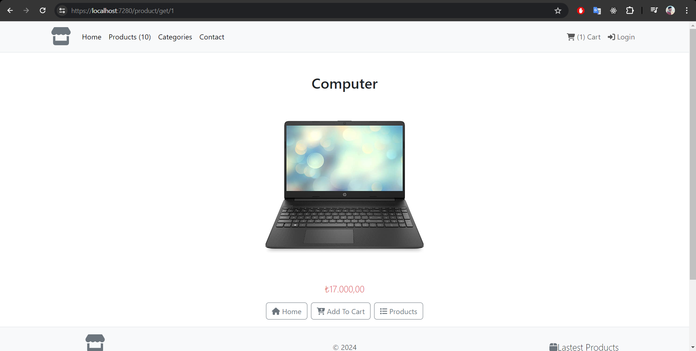
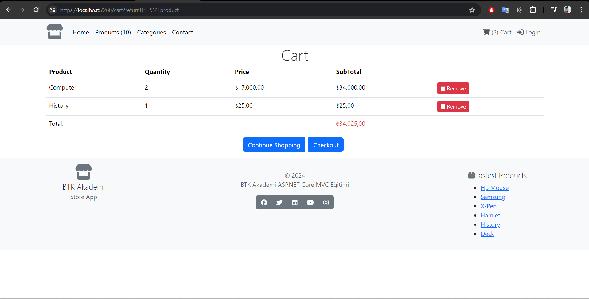
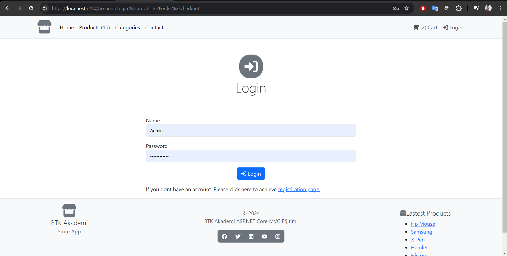
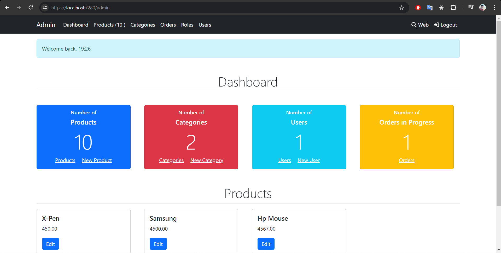

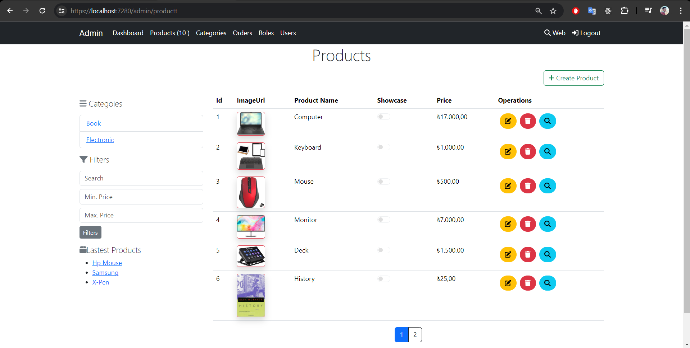
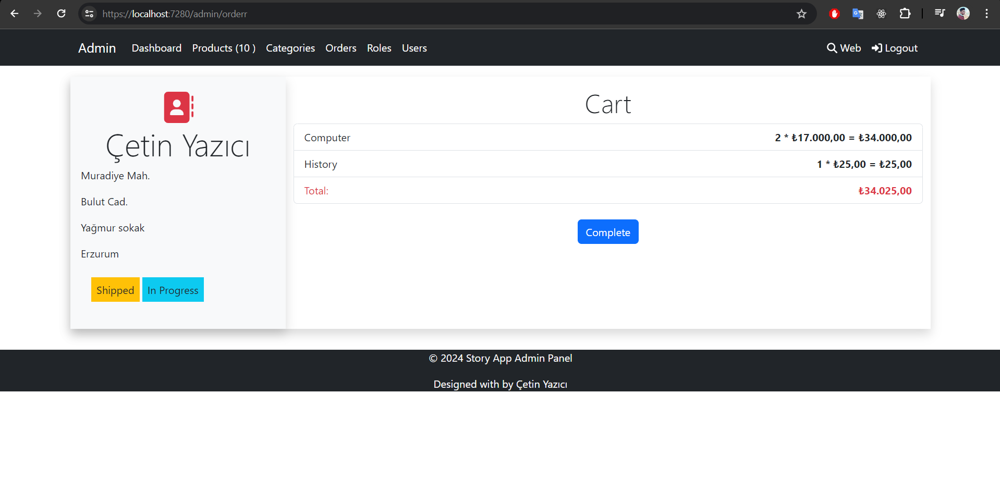
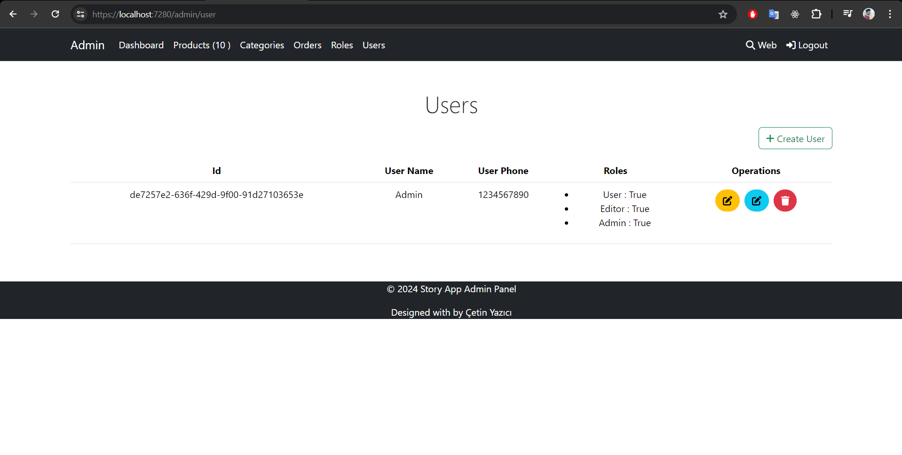
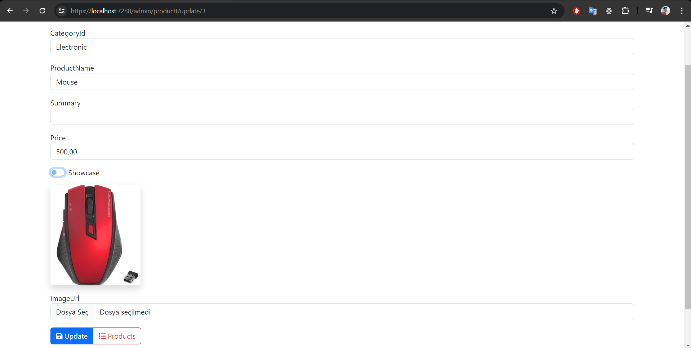

## Başlangıç

Her iki projeyi de yerel olarak kurmak ve çalıştırmak için aşağıdaki adımları izleyiniz.

### Önkoşullar

Projeleri çalıştırmadan önce .NET Core SDK ve SQL Server'ın kurulu olması gerekmektedir.

### Kurulum

#### BTkAkademi

```bash
git clone https://github.com/cetinyazici/ASP.NET-Core-MVC
cd BTkAkademi
dotnet restore
dotnet run
```

#### StoreApp

```bash
git clone https://github.com/cetinyazici/ASP.NET-Core-MVC
cd StoreApp
dotnet restore
dotnet run
```

### Katkıda Bulunma

Projelere katkıda bulunmak isteyenler, ilgili repository'yi forkladıktan sonra pull request gönderebilirler. Katkıda bulunmak isteyenler için rehber:

```bash
git checkout -b ozellik/YeniOzellik
git commit -am 'Yeni özellik eklendi'
git push origin ozellik/YeniOzellik
```

### İletişim

- E-posta: cetin.yazici2525@gmail.com
- LinkedIn: [cetinyazici](https://www.linkedin.com/in/cetinyazici)
- GitHub: [cetinyazici](https://github.com/cetinyazici)
